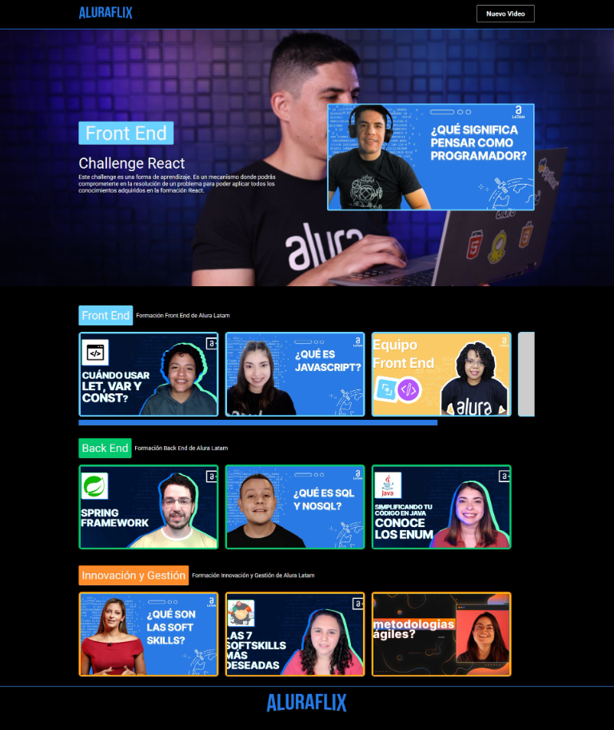

# Challenge ONE React `Sprint 02` - Aluraflix

AluraFlix plataforma de videos, proyecto realizado para el curso de Desarrollo Web Front End en ALura - Oracle ONE Next Education

Este proyecto ha sido realizado con [Create React App](https://github.com/facebook/create-react-app) 

## `Creando componentes`
Sprint 1:
Componentes creados para este Sprint:
* Button 
* Header
* Banner
* Footer
* DefaultPage
* Carrusel
* Slider
* Video Card
* Se genera archivo datos_iniciales.json para probar la funcionalidad del carrusel de videos. (Para el el Sprint 02 se implementará esta funcionalidad consumiendo los datos desde una API).

Sprint 2:
* Componente para registro de nueva categoria. `(En desarrollo)`
* Componente para registro de nuevo Video. `(En desarrollo)`
* Se implementa conexion con fake API (mackapi.io). No se requiere el uso del archivo datos_iniciales.json.

## Biliotecas utilizadas
* React-Router-Dom.
* Styled-components.
* Axios.

## Acerca del autor:

* [Alura]()
* [LinkedIn](https://www.linkedin.com/in/carlos-munera-259969262 "Linkedin")
